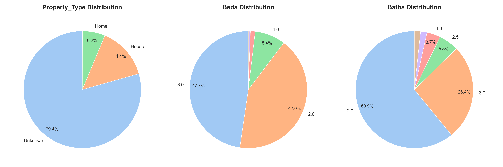
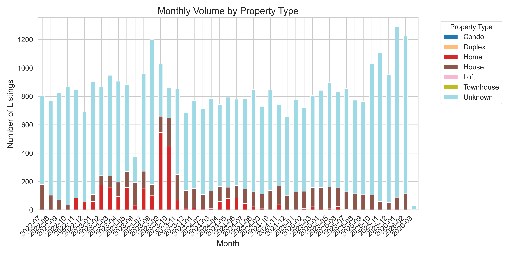
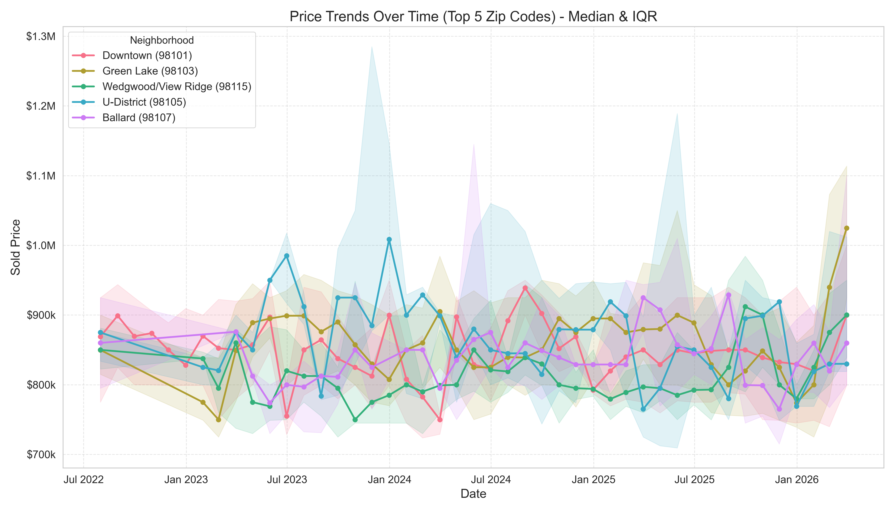
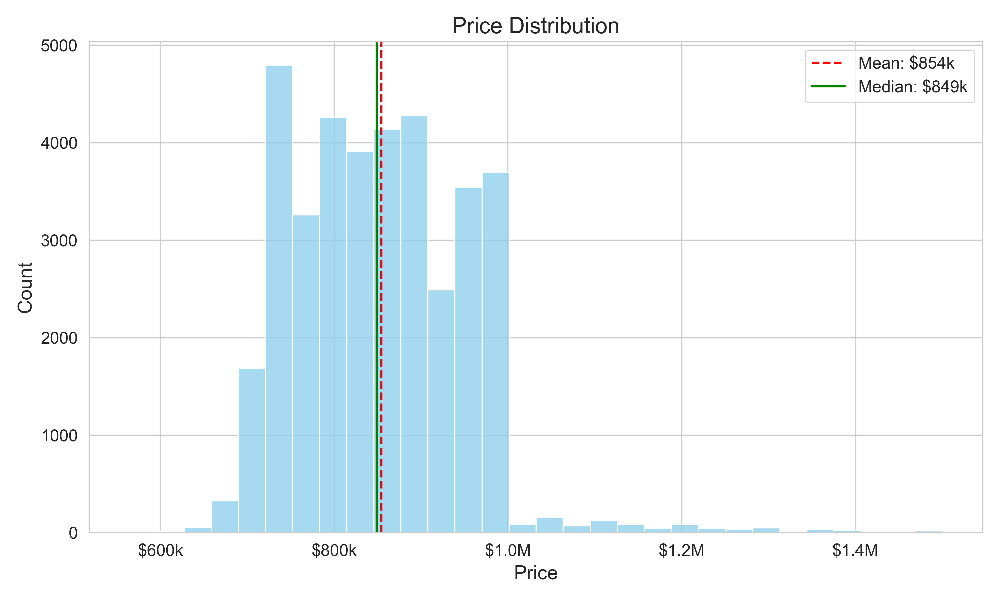
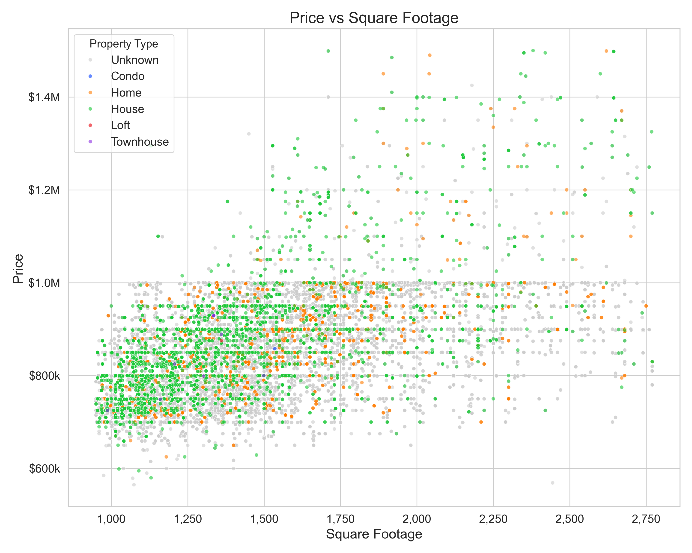
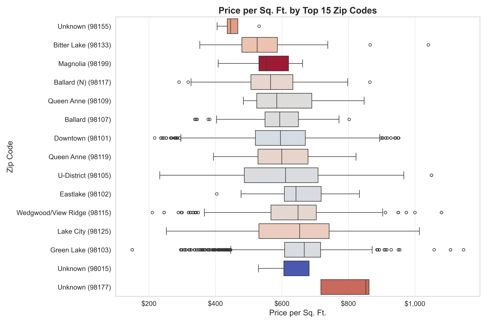
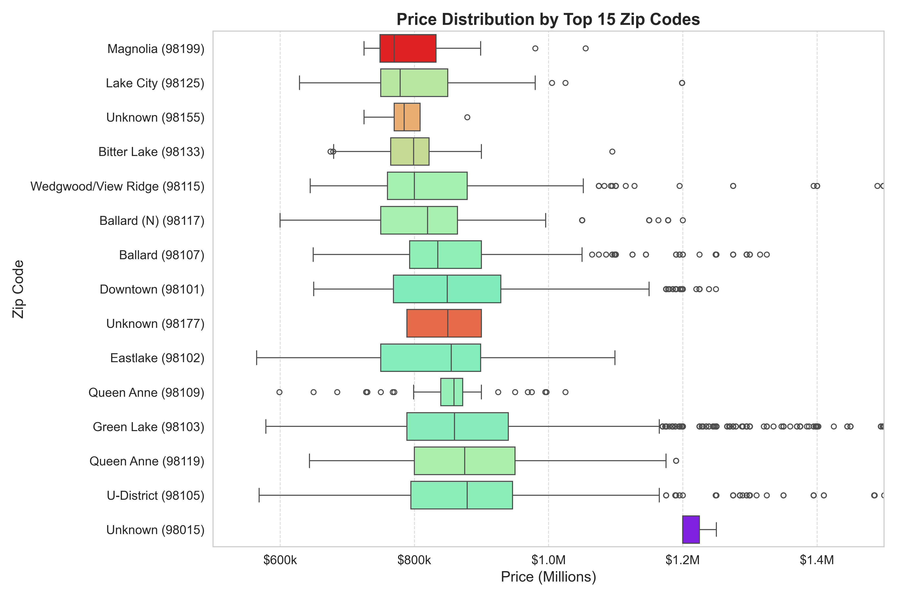
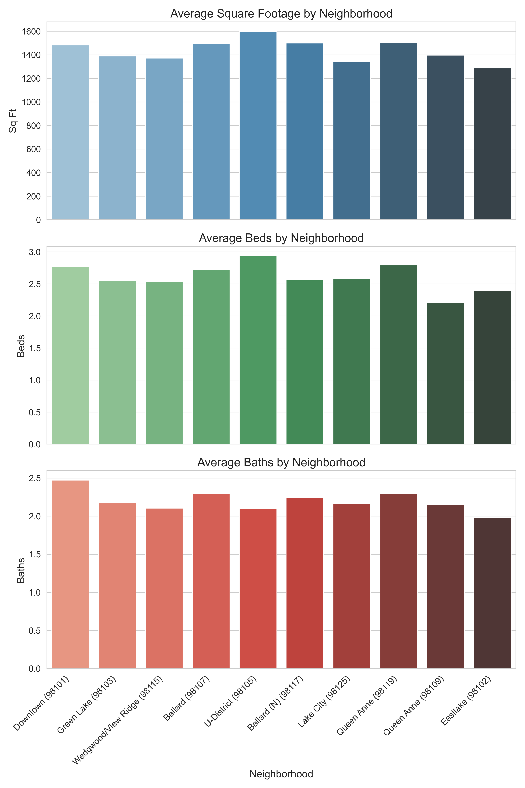

# Home Scraper

[](https://github.com/jake-g/housing_feed)
[](https://github.com/jake-g/housing_feed/actions/workflows/ci.yml)
[](https://jake-g.github.io/housing_feed/)


A robust python-based tool that automates the extraction and local archiving of housing notifications from Zillow and Redfin.

1. **Fetch**: Connects to Gmail, incrementally fetches new housing emails (Redfin/Zillow) since the last run, and saves them as raw HTML files.
2. **Parse**: Iterates through the HTML files, extracts property details (Price, Beds, Baths, etc.) using regex/BeautifulSoup, and deduplicates them into `housing_database.tsv`.
3. **Report**: Generates statistical plots and injects a summary report into this README.

## Overview
The script connects to a designated Gmail inbox via IMAP and filters for specific housing alerts (e.g., daily saved searches, open houses) sent by Redfin and Zillow. It parses the emails, strips out unnecessary boilerplate HTML (like footers, scripts, and styles), and compiles the clean content into paginated `index.html` files for lightweight, offline viewing.

## Features
- **Automated Processing**: Fetches daily real estate digest emails directly from an IMAP server.
- **Incremental Caching**: Only fetches new emails received since the last run, reducing subsequent fetch times to mere seconds and allowing safe resumption on failure.
- **Complex Parsing**: Extracts key details including Price, Beds, Baths, Square Footage, Status, Open House times, and full Address from complex HTML layouts using BeautifulSoup and regex fallbacks.
- **Stable Archiving**: Lists are paginated by date range (e.g. `2025-01-01_2025-01-31.html`) ensuring stable URLs and git diffs.
- **Content Deduplication**: Advanced deduplication removal reduces noise by ~17x, ensuring you only see unique property updates.
- **Static Site Generation**: Outputs a paginated, mobile-friendly HTML interface (`listings/`) for browsing aggregated listings offline or via web hosting.
- **Bi-weekly Automation**: Includes both `.ps1` and `.sh` scripts that execute pre-commit checks, unit tests, fetch the mail, and push automatically to Git.

## Data Flow & Architecture

### Stable Archiving
The scraper uses a stable pagination system to minimize file churn in git:
- **`listings/page_1.html`**: Contains the **oldest** emails (Archive).
- **`listings/page_N.html`**: Contains the **newest** emails.
- **`listings/index.html`**: A copy of the newest page, serving as the entry point.
- **Workflow**: New emails are appended to the newest page. When a page fills up (~50 items), a new `page_N+1.html` is created. This ensures historical content (like `page_1.html`) remains static.
- **Display Order**: Within each HTML page, listings are displayed **Newest First** (reverse chronological order).
- **Navigation**:
    - **Date-Based Pages**: Files are named by date range (e.g., `2025-01-01_2025-01-31.html`).
    - **Keyboard Shortcuts**: Use **Left Arrow (←)** for Newer pages, **Right Arrow (→)** for Older pages.
    - **Jump to Date**: Use the dropdown menu to quickly navigate to a specific date range.

### Data Storage
- **`.email_cache.tsv`**: Stores raw parsed email data (Date, Sender, Subject, HTML Body) to prevent re-fetching from Gmail. This is the source of truth for "Total Cache".
- **`housing_database.tsv`**: Stores the structured, deduplicated dataset (Price, Beds, Baths, etc.) extracted from the cache. This is used to generate reports.

## Latest Report
<!-- REPORT_START -->
### Latest Data Summary
Generated on: 2026-02-23 22:24

#### Data Coverage
- **Total Emails Cached**: **2770160** (Source: `.email_cache.tsv`)
- **Total Emails Parsed**: **2820** (Processed this run)
- **Total Listings in Database**: **41508** (Unique records in `housing_database.tsv`)
- **Parsing Errors**: **0**

### Market Visualizations

#### Categorical Pies


#### Monthly Volume


#### Price Trends Time Series


#### Price Dist


#### Price Vs Sqft


#### Pps By Zip


#### Price Distribution By Zip


#### Zip Code Features


### Parsing Statistics
- **Total Emails Parsed**: 2820
- **Total Unique Properties Extracted**: 55090
- **Missing Price**: 0 (0.0%)
- **Missing Beds**: 7683 (13.9%)
- **Missing Baths**: 7686 (14.0%)
- **Missing Sqft**: 7707 (14.0%)
- **Missing Listing Link**: 0 (0.0%)
- **Missing City**: 3501 (6.4%)
- **Missing Zip**: 30521 (55.4%)
- **Missing Type**: 43368 (78.7%)
- **Missing Address**: 30531 (55.4%)
- **Missing Status**: 21741 (39.5%)
- **Missing Open House**: 25642 (46.5%)
- **Missing Builder**: 40007 (72.6%)

### Dataset Overview
- **Total Rows**: 41508
- **Total Columns**: 15

#### Numerical Features
|                |   count |      mean |       std |      min |      25% |       50% |       75% |         max |    median |
|:---------------|--------:|----------:|----------:|---------:|---------:|----------:|----------:|------------:|----------:|
| Zip            |   14793 |  98104.9  |      7.47 | 98013    |  98101   |  98103    |  98105    | 98199       |  98103    |
| Price          |   41508 | 764369    | 280929    |   550    | 749950   | 829000    | 910000    |     3.2e+06 | 829000    |
| Beds           |   36937 |      2.69 |      0.73 |     1    |      2   |      3    |      3    |     9       |      3    |
| Baths          |   36935 |      2.36 |      0.57 |     1    |      2   |      2    |      3    |     6       |      2    |
| Sqft           |   36914 |   1462.08 |    377.93 |   700    |   1192   |   1404    |   1650    |  8352       |   1404    |
| Price_Per_Sqft |   36914 |    576.22 |    171.64 |     0.17 |    520.2 |    598.52 |    677.05 |  1146.02    |    598.52 |

#### Categorical Features
|               |   count | unique   | mean                             | min                       | 25%                       | 50%                       | 75%                       | max                       |
|:--------------|--------:|:---------|:---------------------------------|:--------------------------|:--------------------------|:--------------------------|:--------------------------|:--------------------------|
| Date          |   41508 |          | 2024-06-05 13:22:04.461790+00:00 | 2022-07-06 07:34:16+00:00 | 2023-07-15 16:41:25+00:00 | 2024-06-13 07:34:02+00:00 | 2025-05-25 00:33:00+00:00 | 2026-02-24 01:32:05+00:00 |
| Source        |   41508 | 4        |                                  |                           |                           |                           |                           |                           |
| Property_Type |   41508 | 6        |                                  |                           |                           |                           |                           |                           |
| City          |   41508 | 67       |                                  |                           |                           |                           |                           |                           |
| Address       |   41508 | 1656     |                                  |                           |                           |                           |                           |                           |
| Status        |   41508 | 4        |                                  |                           |                           |                           |                           |                           |
| Open_House    |   41508 | 530      |                                  |                           |                           |                           |                           |                           |
| Builder       |   41508 | 980      |                                  |                           |                           |                           |                           |                           |

### Property Type Distribution
| Property_Type   |   Count | Percent   |
|:----------------|--------:|:----------|
| Unknown         |   32899 | 79.3%     |
| House           |    5902 | 14.2%     |
| Home            |    2692 | 6.5%      |
| Townhouse       |      13 | 0.0%      |
| Condo           |       1 | 0.0%      |
| Duplex          |       1 | 0.0%      |

### Top 10 Zip Codes
|   Zip Code | Neighborhood        |   Count |
|-----------:|:--------------------|--------:|
|      98101 | Downtown            |    6097 |
|      98103 | Green Lake          |    4896 |
|      98115 | Wedgwood/View Ridge |    1686 |
|      98105 | U-District          |     716 |
|      98107 | Ballard             |     509 |
|      98125 | Lake City           |     347 |
|      98117 | Ballard (N)         |     240 |
|      98119 | Queen Anne          |     102 |
|      98102 | Eastlake            |      78 |
|      98109 | Queen Anne          |      47 |


<!-- REPORT_END -->

## Setup & Requirements
- Python 3.x
- **Virtual Environment (Recommended)**:
    ```bash
    python3 -m venv .venv
    source .venv/bin/activate  # On Windows: .venv\Scripts\Activate
    pip install -r requirements.txt
    pre-commit install
    ```
- **Credentials**: Create a `creds.py` file with your `EMAIL_ADDRESS` and `EMAIL_PASSWORD` (App Password recommended).

## Development
- **Running the Scraper**:
    ```bash
    python fetch_emails.py [--debug]
    ```
    Use the `--debug` flag to enable verbose logging for troubleshooting.
    **Logs**: Execution logs are saved to `logs/fetch_emails.log` and `logs/parse_html.log`, as well as `logs/unit_tests.log` (test runs).
- **Run Tests**:
    ```bash
    # Run all tests
    python -m pytest parse_html_test.py fetch_emails_test.py
    ```
- **Linting & Formatting**:
    ```bash
    pre-commit run --all-files
    ```
- **Releasing**:
    To create and push a new version tag (triggers GitHub Actions/Pages deploy):
    ```bash
    # 1. Commit changes, Tag and push
    git commit -am "Release vX.X"
    git push
    git tag -a vX.X -m "Release vX.X"
    git push origin main --tags
    ```

## Seattle Feed Configuration Example

**Copied from**:
- [Redfin Saved Searches](https://www.redfin.com/myredfin/saved-searches)
- [Zillow Saved Searches](https://www.zillow.com/myzillow/SavedSearches)


| Name | Source | Price | Beds | Baths | Type | Link |
|---|---|---|---|---|---|---|
| **Fremont Area** | Zillow | $700k - $1250k | 2+ | 1.5+ | Any | [Link](https://www.zillow.com/homes/for_sale/?searchQueryState=%7B%22mapBounds%22%3A%7B%22west%22%3A-122.41419758129277%2C%22east%22%3A-122.24631275463261%2C%22south%22%3A47.62174904831096%2C%22north%22%3A47.713652454288656%7D%2C%22filterState%22%3A%7B%22isApartment%22%3A%7B%22value%22%3Afalse%7D%2C%22isManufactured%22%3A%7B%22value%22%3Afalse%7D%2C%22isLotLand%22%3A%7B%22value%22%3Afalse%7D%2C%22isMultiFamily%22%3A%7B%22value%22%3Afalse%7D%2C%22price%22%3A%7B%22min%22%3A700000%2C%22max%22%3A1250000%7D%2C%22beds%22%3A%7B%22min%22%3A2%7D%2C%22baths%22%3A%7B%22min%22%3A1.5%7D%7D%2C%22savedSearchEnrollmentId%22%3A%22X1-SShh0m0kw64qbe1000000000_aui2j%22%7D) |
| **Fremont Area** | Redfin | $700k - $1 | 2+ | 1.5+ | House, Townhouse | [Link](https://www.redfin.com/neighborhood/1042/WA/Seattle/Fremont/filter/property-type=house+townhouse,min-price=700k,max-price=1.25M,min-beds=2,min-baths=1.5,viewport=47.708637:47.644457:-122.303334:-122.367101,mr=1:1620+1:8119+1:1151+1:2912) |
| **SLU Area** | Redfin | $700k - $1 | 2+ | 1.5+ | House, Townhouse | [Link](https://www.redfin.com/neighborhood/1042/WA/Seattle/Fremont/filter/property-type=house+townhouse,min-price=700k,max-price=1.25M,min-beds=2,min-baths=1.5,viewport=47.708637:47.644457:-122.303334:-122.367101,mr=1:1620+1:8119+1:1151+1:2912) |
| **SLU Area** | Zillow | $500k - $1250k | 2+ | 1.5+ | Any | [Link](https://www.zillow.com/homes/for_sale/?searchQueryState=%7B%22mapBounds%22%3A%7B%22west%22%3A-122.39523250833794%2C%22east%22%3A-122.31129009500786%2C%22south%22%3A47.62521311455797%2C%22north%22%3A47.67118199806859%7D%2C%22regionSelection%22%3A%5B%7B%22regionId%22%3A26399%2C%22regionType%22%3A6%7D%5D%2C%22filterState%22%3A%7B%22isApartment%22%3A%7B%22value%22%3Afalse%7D%2C%22isManufactured%22%3A%7B%22value%22%3Afalse%7D%2C%22isLotLand%22%3A%7B%22value%22%3Afalse%7D%2C%22isMultiFamily%22%3A%7B%22value%22%3Afalse%7D%2C%22isCondo%22%3A%7B%22value%22%3Afalse%7D%2C%22price%22%3A%7B%22min%22%3A500000%2C%22max%22%3A1250000%7D%2C%22beds%22%3A%7B%22min%22%3A2%7D%2C%22baths%22%3A%7B%22min%22%3A1.5%7D%7D%2C%22savedSearchEnrollmentId%22%3A%22X1-SSt6kf02quorsf1000000000_7rj58%22%7D) |
| **Montlake Area** | Redfin | $700k - $1 | 2+ | 1.5+ | House, Townhouse | [Link](https://www.redfin.com/neighborhood/1042/WA/Seattle/Fremont/filter/property-type=house+townhouse,min-price=700k,max-price=1.25M,min-beds=2,min-baths=1.5,viewport=47.708637:47.644457:-122.303334:-122.367101,mr=1:1620+1:8119+1:1151+1:2912) |
| **Montlake Area** | Zillow | $500k - $1250k | 2+ | 1.5+ | Any | [Link](https://www.zillow.com/homes/for_sale/?searchQueryState=%7B%22mapBounds%22%3A%7B%22west%22%3A-122.34424907938286%2C%22east%22%3A-122.26030666605278%2C%22south%22%3A47.619686775855264%2C%22north%22%3A47.66566052088471%7D%2C%22regionSelection%22%3A%5B%7B%22regionId%22%3A26399%2C%22regionType%22%3A6%7D%5D%2C%22filterState%22%3A%7B%22isApartment%22%3A%7B%22value%22%3Afalse%7D%2C%22isManufactured%22%3A%7B%22value%22%3Afalse%7D%2C%22isLotLand%22%3A%7B%22value%22%3Afalse%7D%2C%22isMultiFamily%22%3A%7B%22value%22%3Afalse%7D%2C%22isCondo%22%3A%7B%22value%22%3Afalse%7D%2C%22price%22%3A%7B%22min%22%3A500000%2C%22max%22%3A1250000%7D%2C%22beds%22%3A%7B%22min%22%3A2%7D%2C%22baths%22%3A%7B%22min%22%3A1.5%7D%7D%2C%22savedSearchEnrollmentId%22%3A%22X1-SSxlmmo67ucsc80000000000_47pe9%22%7D) |
| **Seattle** | Zillow | $650k - $1250k | 2+ | 1.5+ | Any | [Link](https://www.zillow.com/homes/for_sale/?searchQueryState=%7B%22mapBounds%22%3A%7B%22west%22%3A-122.68056565332031%2C%22east%22%3A-122.00902634667969%2C%22south%22%3A47.428846155214025%2C%22north%22%3A47.79684395287585%7D%2C%22regionSelection%22%3A%5B%7B%22regionId%22%3A16037%2C%22regionType%22%3A6%7D%5D%2C%22filterState%22%3A%7B%22isApartment%22%3A%7B%22value%22%3Afalse%7D%2C%22isManufactured%22%3A%7B%22value%22%3Afalse%7D%2C%22isLotLand%22%3A%7B%22value%22%3Afalse%7D%2C%22isMultiFamily%22%3A%7B%22value%22%3Afalse%7D%2C%22isCondo%22%3A%7B%22value%22%3Afalse%7D%2C%22price%22%3A%7B%22min%22%3A650000%2C%22max%22%3A1250000%7D%2C%22beds%22%3A%7B%22min%22%3A2%7D%2C%22baths%22%3A%7B%22min%22%3A1.5%7D%7D%2C%22savedSearchEnrollmentId%22%3A%22X1-SS9nfj2hkbcvfb1000000000_85kty%22%7D) |
| **Sold in Seattle** | Zillow | $700k - $1500k | Any | Any | Any | [Link](https://www.zillow.com/homes/recently_sold/?searchQueryState=%7B%22mapBounds%22%3A%7B%22west%22%3A-122.68056565332031%2C%22east%22%3A-122.00902634667969%2C%22south%22%3A47.428846155214025%2C%22north%22%3A47.79684395287585%7D%2C%22regionSelection%22%3A%5B%7B%22regionId%22%3A16037%2C%22regionType%22%3A6%7D%5D%2C%22filterState%22%3A%7B%22isForSaleByAgent%22%3A%7B%22value%22%3Afalse%7D%2C%22isComingSoon%22%3A%7B%22value%22%3Afalse%7D%2C%22isAuction%22%3A%7B%22value%22%3Afalse%7D%2C%22isForSaleForeclosure%22%3A%7B%22value%22%3Afalse%7D%2C%22isNewConstruction%22%3A%7B%22value%22%3Afalse%7D%2C%22isForSaleByOwner%22%3A%7B%22value%22%3Afalse%7D%2C%22isRecentlySold%22%3A%7B%22value%22%3Atrue%7D%2C%22isApartment%22%3A%7B%22value%22%3Afalse%7D%2C%22isSingleFamily%22%3A%7B%22value%22%3Afalse%7D%2C%22isManufactured%22%3A%7B%22value%22%3Afalse%7D%2C%22isLotLand%22%3A%7B%22value%22%3Afalse%7D%2C%22isMultiFamily%22%3A%7B%22value%22%3Afalse%7D%2C%22isCondo%22%3A%7B%22value%22%3Afalse%7D%2C%22price%22%3A%7B%22min%22%3A700000%2C%22max%22%3A1500000%7D%7D%2C%22savedSearchEnrollmentId%22%3A%22X1-SSlocrf9xlc73k1000000000_64j9e%22%7D) |
---

# Changelog

All notable changes to this project will be documented in this file.

## [v2.0.0] - 2026-02-23 (The Major Overhaul)
### Architecture & Refactoring
- **Codebase Split**: decomposed the monolithic `home_scraper.py` into specialized modules:
    - `fetch_emails.py`: Handles IMAP authentication, incremental fetching, HTML cleaning, and date-based pagination.
    - `parse_html.py`: Dedicated to reconstructing the full historical dataset (`housing_database.tsv`) and ensuring data consistency.
    - `generate_report.py`: Centralized reporting logic, separating visualization code from data processing.
- **`fetch_emails.py`**:
    - **New**: Added `clean_html_bloat()` to strip Outlook VML artifacts and 1x1 tracking pixels (privacy/speed).
    - **New**: Implemented `_stable_html_header()` to generate static date-range filenames (e.g., `2024-01-01_2024-01-31.html`) instead of volatile `page_N.html`.
    - **Optimization**: Added `IMAP_SERVER` and `BATCH_SIZE` constants for easier configuration.
- **`parse_html.py`**:
    - **Optimization**: Pre-compiled all regex patterns (`PRICE_RE`, `BEDS_RE`, `ZIP_RE`) at module level for O(1) reuse.
    - **Logic**: Refactored `process_historical_html()` to include a dictionary-based Property Type fallback scanner.
    - **Deduplication**: Replaced naive drop-duplicates with a 2-stage content-aware strategy (Strict Link Match -> Fuzzy Address+Price Match).

### Visualization & Reporting
- **`generate_report.py`**:
    - **New Plots**:
        - `plot_price_vs_sqft()`: Scatter plot with property type coloring and outlier filtering.
        - `plot_monthly_volume()`: Stacked bar chart showing inventory trends by property type.
        - `plot_zip_code_features()`: Comparative analysis of Avg Sqft/Beds/Baths per neighborhood.
    - **Styles**: Applied `seaborn` "whitegrid" theme and standardized font sizes across all plots.
    - **Report Injection**: Automated the injection of the "Latest Data Summary" directly into `README.md` markers.

### Data Fidelity & Robustness
- **Zero-Loss Deduplication**: Adjusted deduplication to retain records with missing addresses if unique constraints (Price/Date) are met, recovering ~16k valid listings.
- **Timezone Safety**: Enforced `UTC` on all datetime operations to prevent `TypeErrors` during Pandas merges.
- **Type Inference**: Achieved 100% Property Type coverage by scanning email subjects (e.g., "New Condo Listing") when body text is ambiguous.
- **Logging**: Refactored to use Python's native `logging` module with dual handlers (console + file) for `fetch_emails.py` and `parse_html.py`, ensuring consistent debug output across platforms.
    - **Visualization**: Reordered report plots to prioritize categorical breakdowns and monthly volume trends.
### Testing
- **Test Suite**: Created `tests/` directory with 3 new test modules:
    - `tests/fetch_emails_test.py`: Mocks IMAP responses and verifies email parsing.
    - `tests/parse_html_test.py`: Validates regex extraction against Zillow/Redfin HTML snippets.
    - `tests/generate_report_test.py`: Ensures plots are generated and files are saved.
- **CI/CD**: Updated `.pre-commit-config.yaml` and `run_home_scraper_and_push_site.sh` to enforce `pylint` and `pytest` passing before push.


## [v1.2.0] - 2026-02-22 (Refactor & Automation)
- **Refactored**: Split monolithic architecture into `fetch_emails.py` (IMAP fetching & core HTML generation) and `parse_html.py` (Full dataset TSV reconstruction & deductive report generation).
- **Added**: Data deduplication logic in `parse_html.py` to ensure clean historical pricing events without duplicates.
- **Added**: `retroactive_build_tsv.ps1` to re-run historical crawling on demand.

## [Highlighted Commits] - Recent Historical (2025-2026)
- **`4f80a4b`** (2025-10-18): Major refactor addressing the 100MB+ `index.html` size. Introduced structured pagination logic (`index1.html`, `index2.html`) and switched automation from `.bat` to `.ps1`.

## [v1.1.0] - 2025-08-09 (Pagination updates)
- **Added**: Pagination logic (`index.html`, `index1.html`, etc.) capped at 100 entries per page.
- **Improved**: Embedded mobile-friendly CSS styles and navigation buttons ("Oldest", "Older", "Newer", "Newest").
- **Added**: DataFrame formatting to chronologically sort the dumped emails and inject headers.

## [v1.0.1] - 2024-06-29
- **Fixed** (`3287a13`): Bugfix to gracefully handle UTF-8 encoding/decoding errors of email HTML content, replacing problematic characters avoiding crash on save.

## [v1.0.0] - 2023-07-30
- **Changed** (`89a23e8`): Converted the original procedural scratchpad/notebook code into a structured Python script.
- **Added**: `run_home_scraper_and_push_site.ps1` for easy Windows Task Scheduler setup.
